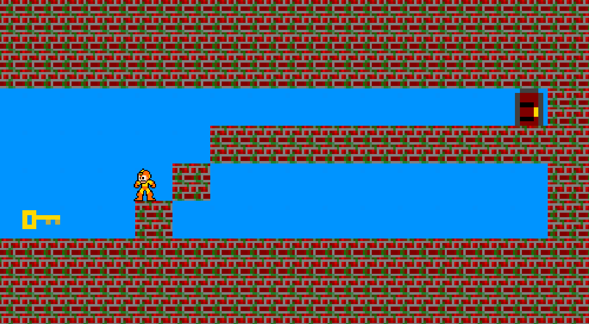
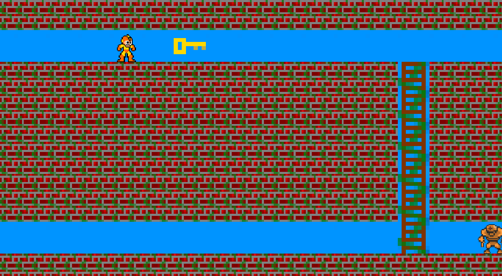

# MazeRunner : Let's start


## Getting Started

- Clone the repo and cd into the directory
```sh
git clone git@github.com:Milkad0/MazeRunnerJava.git
cd MazeRunnerJava
```

- Open the project folder
```sh
...\MazeRunner\MazeRunner-Netbeans
```

### With Netbeans
 
 - Create LWJGL-2.9.3 librairie
 
 Classpath
 
 ```sh
 Lib\lwjgl-2.9.3\jar\lwjgl.jar
 Lib\lwjgl-2.9.3\jar\lwjgl_util.jar
 ```
 
 Sources
 
  ```sh
 Lib\lwjgl-2.9.3\src
  ```
 
 - Create Slick2D librairie
 
  Classpath
  
 ```sh
 Lib\Slick2D\lib\lwjgl.jar
 Lib\Slick2D\lib\lwjgl_util.jar
 Lib\Slick2D\lib\jinput.jar
 Lib\Slick2D\lib\slick-util.jar
 Lib\Slick2D\lib\slick.jar
 ```
 Sources
 
  ```sh
 Lib\Slick2D\src
  ```
  - Change the native folder
  
  Right Click on the project "MazeRunner"
  
  Select "Properties"
  
  Select "Run"
  
  And then complete the VM option with this :
  
  ```sh
  -Djava.library.path=C:\Users\<name of user>...\MazeRunner\Lib\lwjgl-2.9.3\native\<os>
  ```
  
  - Run the project (MazeRunner)

### Command

To play at this game you only need to use the directionals, space and escape keys


#### Goal

Take the key and open the door



#### Power

Eat an apple to be able to break a bloc


#### Ennemies

- Rover

He will try to catch you !



- Jumper

He jumps when he wants to ...
(Legend says he drops apples)


- Pacer

He has unlimited endurance


## Collaborators

Vincent ETHEVE - Quentin BESNOIT - Victor BRIERE

